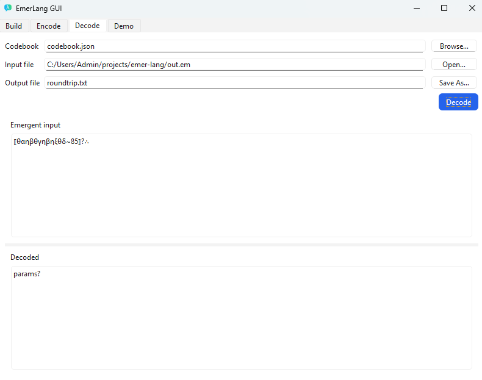

# 🛰️ EmerLang (emerlang)

**Not cryptography.** Educational art-tool that turns text into an “emergent-looking” protocol.

## Install (dev)
```bash
python -m venv venv
# Windows
.\venv\Scripts\activate
# macOS/Linux
source venv/bin/activate

pip install -e .
```

## CLI
```bash
# 1) Build a codebook
emerlang build codebook.json examples/corpora/mini_en.txt --vocab 300 --seed 42

# 2) Encode
emerlang encode codebook.json --in examples/corpora/mini_en.txt --out out.em --structure 0.2

# 3) Decode
emerlang decode codebook.json --in out.em --out roundtrip.txt
```

Stdin/Stdout (Windows-safe if your console is UTF-8):
```powershell
'Hello' | emerlang encode codebook.json > out.em
Get-Content out.em -Raw | emerlang decode codebook.json > roundtrip.txt
```

## GUI
```bash
emerlang-gui
# or:
python -m emerlang.gui.emerlang_gui
```
**Demo tab** animates two encoded messages on the top row (A/B) and reveals their decoded forms on the bottom row after ~2s. The output reflects the actual codebook & structure/seed you choose.

## Preview





## TODO
- crypto.py # optional toy XOR/ChaCha20 wrapper (clearly marked NOT-secure)
-   dialects.py         # seeded symbol palettes, “styles”
-   structure.py        # structural markers, probabilistic templates
-     stego/jsonsteg.py       # key-order, numeric-params, comment/space tricks
-     stego/spacesteg.py      # zero-width/whitespace-based channel
- tests (test_codec, test_reversibility, test_stego)

## Notes
- Input file decoding is tolerant (UTF-8 / UTF-8 BOM / UTF-16 LE/BE).
- Decoder understands both glyph blocks (⟦…~cc⟧) and Greek+digits tokens (e.g., Πε13).
- This is an art/education demo, **not** secure encryption.
